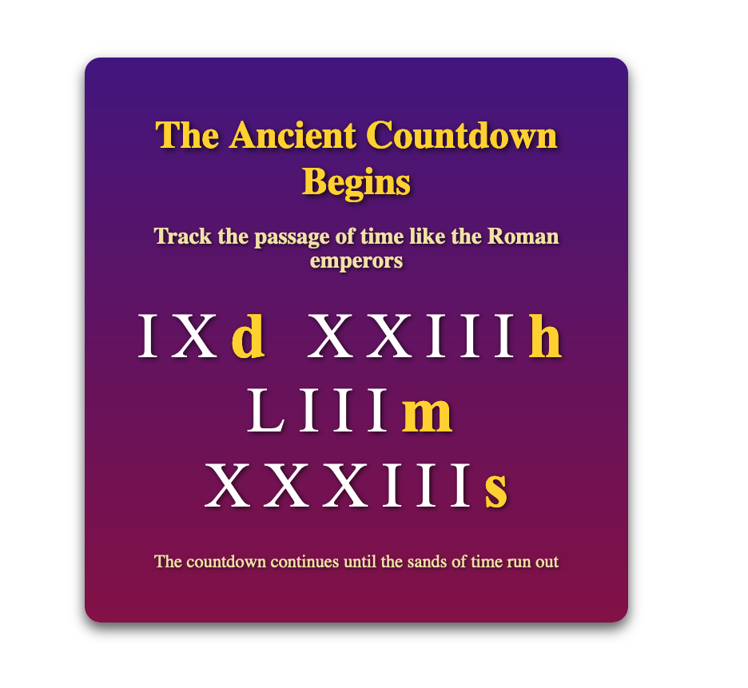

# Roman Numerals Countdown

## Overview

This project is a countdown timer that displays time in Roman numerals, providing a unique and classic experience to track the passage of time. The countdown can be customized to show days, hours, minutes, and seconds, and features an aesthetic inspired by the grandeur of ancient Rome.

## Features

- **Countdown in Roman Numerals**: Displays the remaining time in Roman numerals, making it visually distinctive and thematic.
- **Customizable Units**: Easily configure which units to display, such as days, hours, minutes, and seconds.
- **Responsive Styling**: The countdown container, title, and numbers are styled for an attractive, centered display that enhances the visual experience.
- **Dynamic UI Updates**: The countdown's HTML structure, including a title, subtitle, and footer, is dynamically generated for a seamless user interface.

## Getting Started

To use this project, simply clone the repository and open the `index.html` file in your browser.

```sh
# Clone the repository
git clone https://github.com/yourusername/roman-numerals-countdown.git

# Navigate to the project directory
cd roman-numerals-countdown

# Open the index.html in your preferred browser
```

The countdown will start as soon as the page loads, displaying a custom title, subtitle, and dynamically updating countdown in Roman numerals.

## Customization

- **Change Countdown Duration**: In `script.js`, modify the `targetDate` variable to set a different countdown duration. By default, it is set to 10 days from the current time.
- **Units Display**: You can modify the `showUnits` object to decide which units (days, hours, minutes, seconds) should be displayed.
- **Styling**: Customize the appearance of the countdown by modifying the styles in `style.css` to match your desired theme.

## Usage

This countdown can be used in a variety of settings, such as:
- Special event pages (e.g., product launches, holiday countdowns)
- Educational purposes (learning about Roman numerals)
- Websites that want a unique and visually captivating countdown feature

## Example



The above screenshot demonstrates the Roman Numerals Countdown in action, featuring the fantasy-inspired title and elegant gradient background.

## License

This project is licensed under the MIT License. You are free to use, modify, and distribute this code.

## Contributions

Contributions are welcome! Feel free to open issues or submit pull requests for new features, bug fixes, or improvements.
